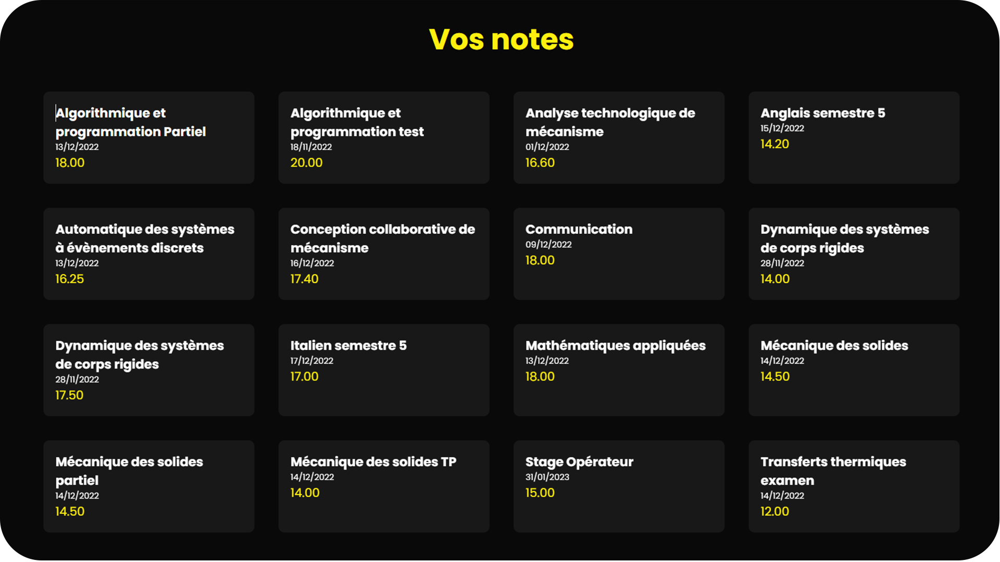

<h1 align="center">Notes ISAE-Supméca</h1>
<p align="center">
	
</p>
<p align="center">A fast and efficient Flask app that simplifies access to my school's online portal.</p>
<p align="center">Utilizing BeautifulSoup4 for data scraping, this handy tool extracts and displays grades.</p>


# Install
```bash
  flask run
```

# Credits

* [**Quentin PETIT**](https://github.com/quentinptt) : Creator of the project.

